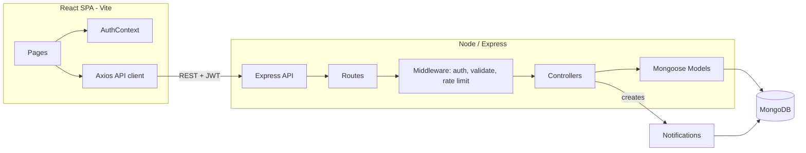
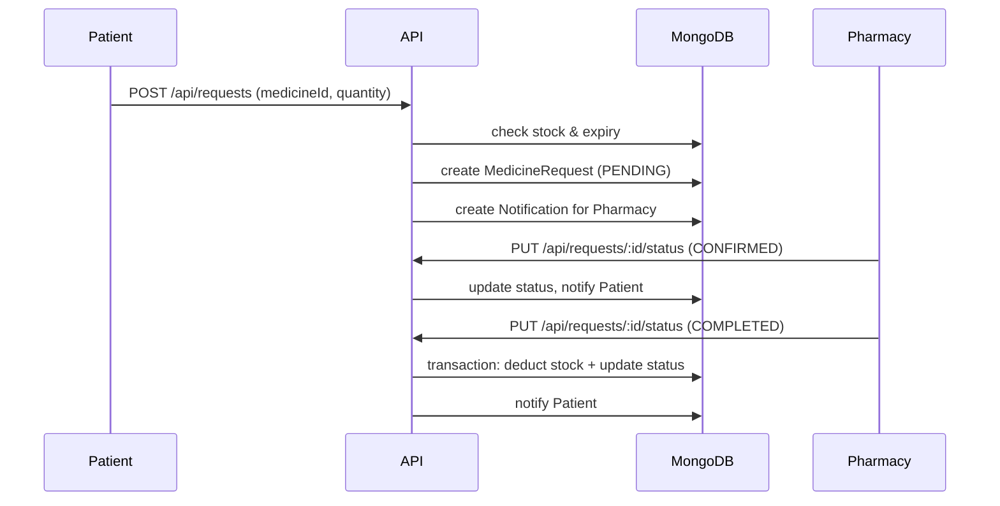

# MedFind — Medicine Access & Pharmacy Availability Platform

MedFind helps patients find nearby, verified pharmacies that currently have a
needed medicine in stock, and lets them submit a reservation request directly
to the pharmacy. Pharmacies manage their own inventory and requests; admins
verify pharmacies and oversee the platform.

**Important:** MedFind is an information and availability platform only. It
does not diagnose conditions, prescribe medication, or recommend
substitutes. Users are always directed to contact a pharmacist or healthcare
professional for medical guidance.

---

## 1. Problem Statement

Patients often don't know which nearby pharmacy actually has a specific
medicine in stock, and end up calling or visiting several pharmacies before
finding one. MedFind centralizes pharmacy inventories and location data so
patients can search once, see real availability and distance, and reserve
the medicine online instead of guessing.

## 2. Core Features

- Three roles: **Patient**, **Pharmacy**, **Admin**, each with its own
  dashboard and permissions.
- JWT authentication with bcrypt-hashed passwords and role-based route
  protection.
- Medicine search across all approved pharmacies, with distance (via the
  browser Geolocation API + Haversine formula), verification, availability
  and category filters.
- Pharmacy inventory CRUD with expiry tracking and a configurable low-stock
  threshold.
- Pharmacy verification workflow: pharmacies register as `PENDING`; only an
  admin can move them to `APPROVED`, `REJECTED`, or `SUSPENDED`.
- Medicine request/reservation workflow with a strict state machine
  (`PENDING → CONFIRMED/REJECTED`, `CONFIRMED → COMPLETED`, and
  `PENDING/CONFIRMED → CANCELLED`), so a request can't jump straight from
  pending to completed.
- Inventory is only decremented when a request is marked `COMPLETED`, inside
  a MongoDB transaction, so concurrent completions can't oversell stock.
- In-app notifications for both patients and pharmacies at each status
  change.
- Admin dashboard with platform-wide statistics and pharmacy
  approve/reject/suspend actions.
- Urgent vs normal request marking, with a standing disclaimer that
  availability can change and the pharmacy should be contacted directly.
- Responsive layout: sidebar becomes a horizontal scroll strip and tables
  become stacked cards on mobile.

## 3. Technology Stack

**Frontend:** React 18, React Router 6, Axios, plain CSS (no UI framework),
Vite as the dev server/bundler.

**Backend:** Node.js, Express 4, Mongoose 8, JWT (`jsonwebtoken`), bcrypt
(`bcryptjs`), `express-validator`, Helmet, CORS, `express-rate-limit`,
`express-mongo-sanitize`, Morgan.

**Database:** MongoDB.

**Testing:** Jest + Supertest + `mongodb-memory-server` (an in-memory Mongo
instance, so tests never touch your real database).

## 4. Architecture



Request flow example (medicine reservation):



## 5. Folder Structure

```
medfind/
├── client/                 React frontend (Vite)
│   ├── src/
│   │   ├── components/     Navbar, Sidebar, ProtectedRoute, StatusBadge
│   │   ├── pages/          One file per route/page
│   │   ├── context/        AuthContext (login/register/logout, token storage)
│   │   ├── services/       api.js (Axios instance + interceptors)
│   │   ├── App.jsx         Route definitions
│   │   ├── main.jsx        App entry point
│   │   └── index.css       Full app styling
│   ├── index.html
│   ├── vite.config.js
│   └── .env.example
│
├── server/                 Express backend
│   ├── config/db.js        Mongoose connection
│   ├── models/              User, Pharmacy, Medicine, MedicineRequest, Notification
│   ├── middleware/          auth.js, errorHandler.js, validate.js
│   ├── controllers/         One file per resource
│   ├── routes/               One file per resource, mounted under /api
│   ├── seed/seed.js          Demo data seed script
│   ├── tests/api.test.js     Jest/Supertest integration tests
│   ├── server.js             App entry point
│   └── .env.example
│
├── .gitignore
└── README.md
```

## 6. Database Design

| Model | Key fields | Notes |
|---|---|---|
| **User** | fullName, email, phone, passwordHash, address, location{lat,lng}, role (`patient`\|`admin`), savedPharmacies[] | Admin accounts also live in this collection but are never created via public registration. |
| **Pharmacy** | pharmacyName, ownerName, email, passwordHash, licenseNumber, address, location{lat,lng}, operatingHours, verificationStatus (`PENDING`\|`APPROVED`\|`REJECTED`\|`SUSPENDED`) | `isCurrentlyOpen()` is computed from `operatingHours`, not stored. |
| **Medicine** | pharmacy (ref), name, genericName, category, strength, form, manufacturer, batchNumber, expiryDate, quantity, lowStockThreshold, price, manuallyUnavailable | Virtuals `isExpired`, `isLowStock`, `isAvailable` are derived, never stored, so they can't go stale. |
| **MedicineRequest** | user (ref), pharmacy (ref), medicine (ref), quantityRequested, note, urgency, status, statusReason | Status transitions are enforced server-side (see state machine above). |
| **Notification** | recipientType (`User`\|`Pharmacy`), recipient (ref, polymorphic via `refPath`), title, message, relatedRequest, isRead | One collection serves both patient and pharmacy notifications. |

All models use Mongoose timestamps. Text index on `Medicine.name` /
`genericName` / `category` and compound indexes on the fields used for
filtering (`pharmacy`, `verificationStatus`, `location`) keep search fast.

## 7. REST API Overview

All endpoints are prefixed with `/api`. Protected endpoints require
`Authorization: Bearer <token>`.

| Method | Endpoint | Access | Purpose |
|---|---|---|---|
| POST | /auth/register | Public | Register a patient |
| POST | /auth/login | Public | Login (patient, pharmacy, or admin) |
| GET | /auth/me | Any authenticated | Current account |
| GET/PUT | /users/profile | Patient | View/update own profile |
| PUT | /users/saved-pharmacies/:id | Patient | Toggle a saved pharmacy |
| POST | /pharmacies/register | Public | Register a pharmacy (starts `PENDING`) |
| GET | /pharmacies | Public | List pharmacies (`?verifiedOnly=true`) |
| GET | /pharmacies/nearby | Public | Nearby approved pharmacies by lat/lng |
| GET | /pharmacies/:id | Public | Pharmacy profile + its medicines |
| PUT | /pharmacies/:id | Pharmacy (self) | Update own pharmacy profile |
| GET | /pharmacies/me/dashboard | Pharmacy | Own dashboard stats |
| POST | /medicines | Pharmacy | Add medicine |
| GET | /medicines | Pharmacy | List own inventory |
| GET | /medicines/:id | Public | Single medicine |
| PUT/DELETE | /medicines/:id | Pharmacy (owner) | Update/remove medicine |
| GET | /search/medicines | Public | Main search (`q`, `category`, `verifiedOnly`, `availableOnly`, `lat`, `lng`, `maxDistanceKm`, `sort`) |
| GET | /search/nearby | Public | Nearby pharmacies only |
| POST | /requests | Patient | Create a reservation request |
| GET | /requests | Patient/Pharmacy | List own requests (role-aware) |
| GET | /requests/:id | Owner | Single request |
| PUT | /requests/:id/status | Patient/Pharmacy | Advance status (validated transitions) |
| DELETE | /requests/:id | Patient | Cancel own pending/confirmed request |
| GET | /notifications | Any authenticated | List own notifications |
| PUT | /notifications/:id/read | Any authenticated | Mark one as read |
| GET | /admin/dashboard | Admin | Platform-wide stats |
| GET | /admin/pharmacies(/pending) | Admin | List pharmacies |
| PUT | /admin/pharmacies/:id/approve\|reject\|suspend | Admin | Verification actions |
| GET | /admin/users | Admin | List patients |
| GET | /admin/requests | Admin | List all requests |
| DELETE | /admin/medicines/:id | Admin | Remove an inventory entry |

## 8. Security

- Passwords are hashed with bcrypt (cost factor 10); the hash is never
  returned by any API response (`select: false` on the schema field, and
  stripped again before responding).
- JWTs are signed with `JWT_SECRET` and carry `{ id, role }`.
- `protect` middleware verifies the token and loads the live account (so a
  deactivated/suspended account loses access immediately); `authorize(...)`
  restricts a route to specific roles.
- Helmet sets standard security headers; CORS is locked to `CLIENT_URL`.
- `express-rate-limit` throttles auth endpoints (30 req / 15 min) and all
  `/api` traffic generally (300 req / 15 min).
- `express-mongo-sanitize` strips `$`/`.` operators from user input to
  prevent MongoDB operator injection.
- All input is validated with `express-validator` before hitting a
  controller.
- The admin account is never publicly registerable — it's created only by
  the seed script (or you can write your own one-off script) from
  `ADMIN_EMAIL` / `ADMIN_PASSWORD` in `.env`, which are never committed.

## 9. Installation

### Prerequisites
- Node.js 18+
- npm
- A MongoDB instance — either local (`mongod`) or a free
  [MongoDB Atlas](https://www.mongodb.com/atlas) cluster

### 9.1 Clone / copy the project
Copy the `medfind/` folder into your own project directory.

### 9.2 Backend setup
```bash
cd medfind/server
cp .env.example .env
# edit .env: set MONGO_URI, JWT_SECRET, ADMIN_EMAIL, ADMIN_PASSWORD
npm install
npm run seed     # creates demo admin, patient, pharmacies, medicines
npm run dev      # starts the API on http://localhost:5000 with nodemon
```

The seed script prints the demo accounts it creates, including the admin
email/password you set in `.env` and these fixed demo credentials:

| Role | Email | Password |
|---|---|---|
| Patient | asha.demo@medfind.local | Patient123! |
| Pharmacy (approved) | wellness.demo@medfind.local | Pharmacy123! |
| Pharmacy (approved) | citycare.demo@medfind.local | Pharmacy123! |
| Pharmacy (pending) | newhorizon.demo@medfind.local | Pharmacy123! |

### 9.3 Frontend setup
In a second terminal:
```bash
cd medfind/client
cp .env.example .env
npm install
npm run dev      # starts the app on http://localhost:5173
```

Open `http://localhost:5173` in your browser. The frontend talks to the API
at the URL in `VITE_API_URL` (defaults to `http://localhost:5000/api`).

### 9.4 Try the full flow
1. Register a new patient (or log in as the seeded demo patient).
2. Go to **Find Medicine**, search "Paracetamol" — allow location access
   when prompted to see distances.
3. Log in as the admin account and approve the pending pharmacy
   (**Admin → Pharmacies**) if you want it to show up in search too.
4. Log in as a pharmacy account, add/edit inventory under **Inventory**.
5. As the patient, request a medicine; as the pharmacy, confirm it under
   **Medicine Requests**, then mark it **Completed** — watch the quantity
   drop in **Inventory**.
6. Check the notification counter in the navbar update for both sides.

## 10. Running Tests

```bash
cd medfind/server
npm test
```

Tests use `mongodb-memory-server`, so they spin up a temporary, isolated
MongoDB instance automatically — nothing is written to your real database.
Covered: registration + password hashing, login (success/failure), blocked
access to protected routes without a token, pharmacy defaulting to
`PENDING`, role-based authorization (patient blocked from admin routes),
inventory creation, medicine search, and the "can't request more than
available stock" guard.

## 11. Deployment

**Frontend (Vercel or similar):**
- Build command: `npm run build` (in `client/`)
- Output directory: `dist`
- Set `VITE_API_URL` to your deployed backend's `/api` URL as an environment
  variable in the hosting dashboard.

**Backend (Render, Railway, or similar):**
- Root directory: `server/`
- Build command: `npm install`
- Start command: `npm start`
- Set all variables from `server/.env.example` in the hosting dashboard —
  especially `MONGO_URI` (point it at Atlas), `JWT_SECRET`, `CLIENT_URL`
  (your deployed frontend's URL, for CORS), and the `ADMIN_*` values if
  you'll run the seed script there.

**Database (MongoDB Atlas):**
- Create a free cluster, add a database user, allow your backend host's IP
  (or `0.0.0.0/0` for simplicity in a demo), and copy the connection string
  into `MONGO_URI`.

No other external services are required — the app works fully without a
paid map API, using the browser's Geolocation API plus straight-line
(Haversine) distance calculations.

## 12. Future Improvements

- Move distance filtering into a MongoDB `2dsphere` geospatial index for
  large datasets instead of computing Haversine distance in application
  code.
- Add pagination to search and admin list endpoints.
- Add email/SMS delivery for notifications, not just in-app.
- Add refresh tokens instead of a single long-lived JWT.
- Add a real map view (e.g., Leaflet + OpenStreetMap) using the optional
  `MAP_API_KEY`.
- Add pharmacy analytics (request volume over time, most-requested
  medicines).

---

## Final verification checklist

This is the sequence the project was built against — if you're extending
it, this is a good regression checklist to re-run:

1. Start backend, connect MongoDB, run seed script.
2. Start frontend.
3. Register a new patient → auto-logged in → dashboard loads.
4. Log out, log back in with the same credentials.
5. Register a new pharmacy → status shows `PENDING` on its dashboard.
6. Log in as admin → approve the pharmacy → status flips to `APPROVED`.
7. Log in as that pharmacy → add a medicine with valid expiry/quantity/price.
8. Log in as a patient → search for that medicine → it appears with
   distance (if location granted) and "In stock".
9. Open the pharmacy's detail page → request the medicine.
10. Log in as the pharmacy → see the pending request → confirm it.
11. Mark it completed → inventory quantity decreases by the requested amount.
12. Log in as the patient → request history shows `COMPLETED`.
13. Confirm a notification appeared for each status change on both sides.
14. Try requesting more than the available quantity → rejected with a clear
    message.
15. Try accessing `/admin` as a patient → redirected away.
16. Try calling a protected API route with no token → `401`.
17. Resize the browser to mobile width → sidebar and tables adapt.
